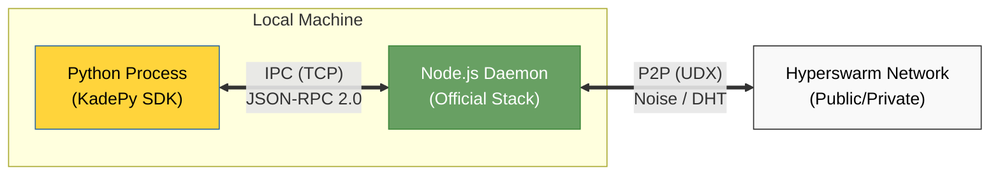

# KadePy Specification (v0.3.0)

KadePy v0.3.0 implements a **Hybrid Architecture** that bridges Python with the official Node.js Hyperswarm stack. This ensures 100% compatibility with the Hyperswarm network, including hole-punching, DHT discovery, and end-to-end encryption.

## 1. Architecture Overview

KadePy operates by spawning a managed Node.js subprocess (`daemon.js`) that handles all low-level networking. The Python process controls this daemon via a local TCP IPC bridge.



## 2. Core Protocols (Network Layer)

KadePy v0.3.0 delegates the network protocol stack to the official modules. It strictly adheres to the following specifications:

-   **Transport**: [UDX](https://github.com/hyperswarm/udx) (UDP-based Reliable Transport).
-   **Discovery**: [HyperDHT](https://github.com/hyperswarm/dht) (Kademlia-based Distributed Hash Table).
-   **Encryption**: [Noise Protocol Framework](https://noiseprotocol.org/) (Noise_XX_25519_ChaChaPoly_BLAKE2b).
-   **Stream Multiplexing**: [Protomux](https://github.com/mafintosh/protomux).

### 2.1. Compatibility
-   **Topics**: 32-byte Buffers (represented as Hex strings in Python).
-   **Keys**: Ed25519 Public Keys (Node IDs).
-   **Discovery**: Fully compatible with public Hyperswarm bootstrap nodes.

## 3. Bridge Protocol (IPC)

Communication between the Python SDK and the Node.js Daemon occurs over a local TCP socket using **JSON-RPC 2.0** messages, delimited by newlines (`\n`).

-   **Transport**: TCP Loopback (127.0.0.1).
-   **Port**: Ephemeral (assigned by OS, passed to Python via stdout during startup).
-   **Encoding**: UTF-8.

### 3.1. Handshake / Startup
1.  Python spawns `node daemon.js`.
2.  Daemon binds a TCP server to port `0` (random).
3.  Daemon prints the port to stdout: `PORT:<12345>`.
4.  Python parses the port and connects via TCP.

### 3.2. Request Format (Python -> Node)
Standard JSON-RPC 2.0 Request:
```json
{
  "jsonrpc": "2.0",
  "method": "join",
  "params": {
    "topic": "deadbeef..."
  },
  "id": 1
}
```

#### Supported Methods:
| Method | Params | Description |
| :--- | :--- | :--- |
| `join` | `topic` (hex) | Join a topic in the DHT. |
| `leave` | `topic` (hex) | Leave a topic. |
| `flush` | None | Wait for all pending DHT queries to complete. |
| `destroy` | None | Gracefully shut down the daemon. |

### 3.3. Event Format (Node -> Python)
Notifications are sent as JSON-RPC 2.0 Notifications (no `id`).

```json
{
  "jsonrpc": "2.0",
  "method": "connection",
  "params": {
    "peerKey": "abcd...",
    "client": true
  }
}
```

#### Supported Events:
| Method | Params | Description |
| :--- | :--- | :--- |
| `connection` | `peerKey`, `client` | New peer connection established. |
| `data` | `peerKey`, `data` (hex) | Data received from a peer. |
| `disconnection`| `peerKey` | Peer disconnected. |
| `error` | `message` | Error occurred. |

### 3.4. Data Transmission
Data sent over the bridge is currently encoded as **Hex Strings** or **Base64** (implementation detail) to ensure binary safety over JSON.

## 4. Security Model

-   **IPC Security**: The TCP bridge binds only to `127.0.0.1`. It is accessible only by processes on the local machine.
-   **Network Security**: All P2P traffic is encrypted using Noise keys generated by the Node.js daemon. The Python side does not handle raw private keys for the transport layer, ensuring the official stack's security guarantees are preserved.

## 5. Future Roadmap

-   **Binary IPC**: Migrate from JSON-RPC to a binary format (e.g., Protobuf or raw struct) for higher throughput.
-   **Shared Memory**: Explore shared memory transport for IPC to reduce copy overhead.
